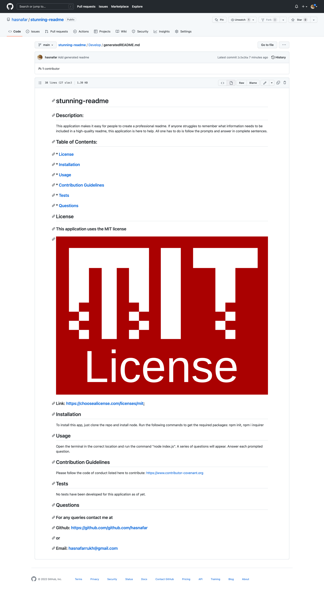

# stunning-readme

## Description
I used node.js to create a command-line applciation that generates a high-quality, professional readme.md file. Once a user runs the "node index.js" command, a series of questions appear. Once the user answers each question, a readme.md file is generated. The inquirer package was used to create the prompted questions and receive input. I created a template of questions which were called using inquirer. Template literals were used to put the data in the respective locations.

## Screenshot

## Links
Git Hub Repo Link: https://github.com/hasnafar/stunning-readme
Walkthrough Video: https://watch.screencastify.com/v/cVfkvTUAc7kEftqRbMz9